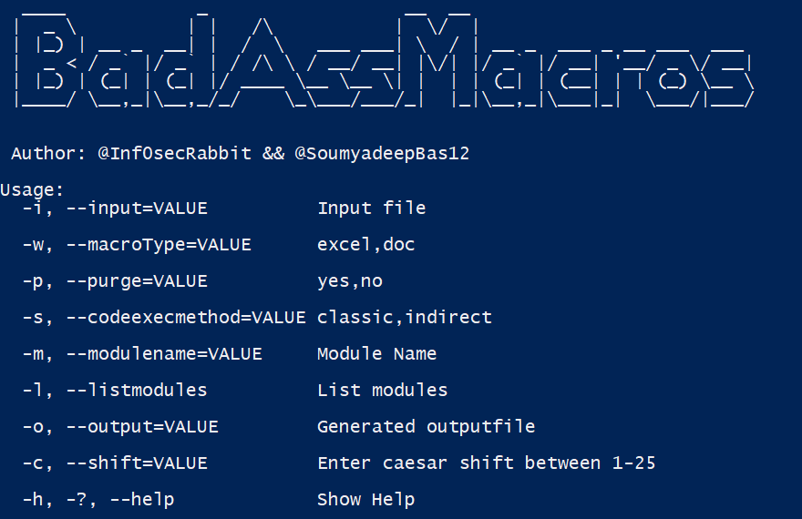
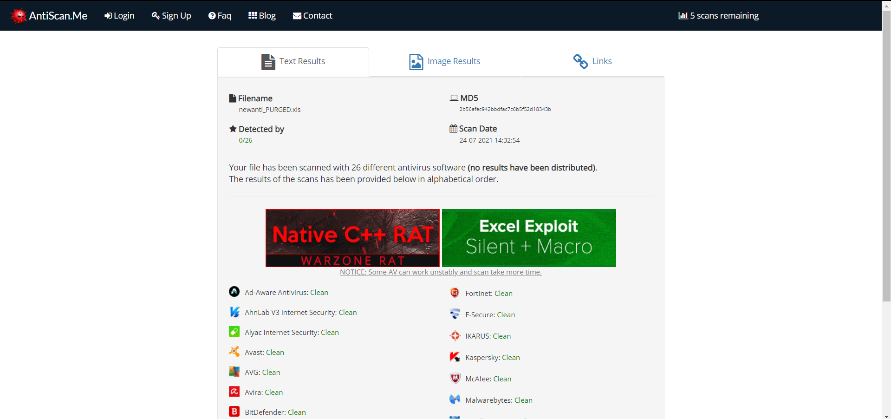

## BadAssMacros
---------------------------


## Description

Proof of Concept tool to generate malicious macros leveraging techniques like VBA Purging and Shellcode Obfuscation to evade AV engines.

This tool takes in raw shellcode that can be generated by popular C2 frameworks like (Metasploit,Cobalt Strike etc) and outputs a VBA macro. 

The tool takes in the malicious doc/excel file ready and embedded with the generated VBA code and performs VBA purging.

### Current Features

BadAssMacros features currently include:

* Classic VBA shellcode injection.
* Indirect VBA shellcode injection (using LoadLibrary).
* Sandbox Detection. 
* VBA Purging.
* Shellcode obfuscation.
* Variable name Randomization.

### Shellcode Injection Techniques

```markdown
|   Name   | x32 |     x64     |
| -------- | --- | ----------- |
| Classic  | Yes | Yes         |
| Indirect | Yes | In Progress |
```


### Ethical use

The BadAssMacros tool is meant to only be used for ethical purposes. Don't use it for bad things. 

## Build Instructions

### Build from sources

BadAssMacros require 3rd party libraries that can be installed from the NuGet package manager.

* Clone the repository in Visual Studio
* Once project is loaded in Visual Studio go to "Tools" --> "NuGet Package Manager" --> "Package Manager Settings" --> "NuGet Package Manager" --> "Package Sources"
* Check if there is a package source with URL - "https://api.nuget.org/v3/index.json". If not create the same.
* Run the following commands
	* `Install-Package Costura.Fody -Version 3.3.3`
	* `Install-Package OpenMcdf -Version 2.2.1.3`
	* `Install-Package Fody -Version 4.0.2`
* Build the project :)

The BadAssMacros.exe will be inside the **bin** directory.  


## Examples

- Show Help
```bash
BadAssMacros.exe -h
```

- Create VBA for classic shellcode injection from raw shellcode
```bash
BadAssMacros.exe -i <path_to_raw_shellcode_file> -w <doc/excel> -p no -s classic -c <caesar_shift_value> -o <path_to_output_file>
```


- Create VBA for indirect shellcode injection from raw shellcode
```bash
BadAssMacros.exe -i <path_to_raw_shellcode_file> -w <doc/excel> -p no -s indirect -o <path_to_output_file>
```


- List modules inside Doc/Excel file
```bash
BadAssMacros.exe -i <path_to_doc/excel_file> -w <doc/excel> -p yes -l
```


- Purge Doc/Excel file 
```bash
BadAssMacros.exe -i <path_to_doc/excel_file> -w <doc/excel> -p yes -o <path_to_output_file> -m <module_name>
```


## Detection 

BadAssMacro was tested against local Antivirus solutions and online services like antiscan.me. The results of testing the same using the Indirect shellcode execution method is attached below.




**NOTE: Please do not submit the samples to VirusTotal** 


## Contact

* [@Inf0secRabbit](https://twitter.com/Inf0secRabbit)
* [@SoumyadeepBas12](https://twitter.com/SoumyadeepBas12)

## Credits

* OfficePurge by FireEye <a href="https://github.com/fireeye/OfficePurge">here</a>
